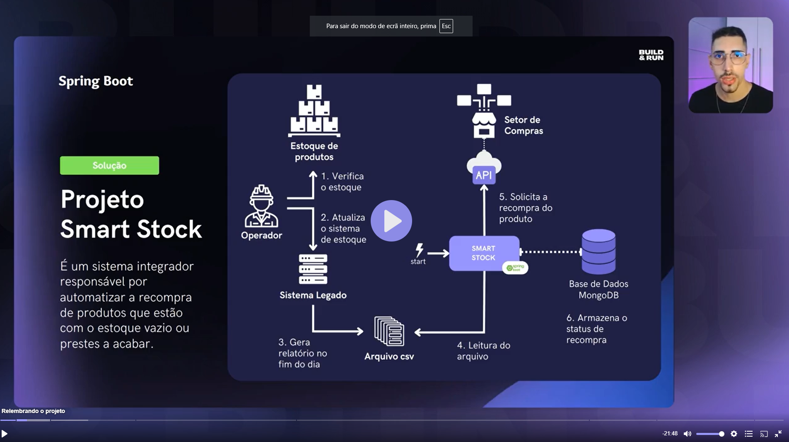

# Para poder iniciar e executar o programa.

* Baixar o MongoDB Compass GUI.
Ferramenta gráfica para gerenciar e visualizar os dados no MongoDB. (https://www.mongodb.com/try/download/compass)

* Instalar o docker na máquina, ele precisa estar executando para aplicação funcionar.
  https://www.docker.com/)

* Conectar o Spring Boot ao MongoDB, no terminal executar o comando:
- cd docker
- docker-compose up

* REGRAS DO PROJETO

 
